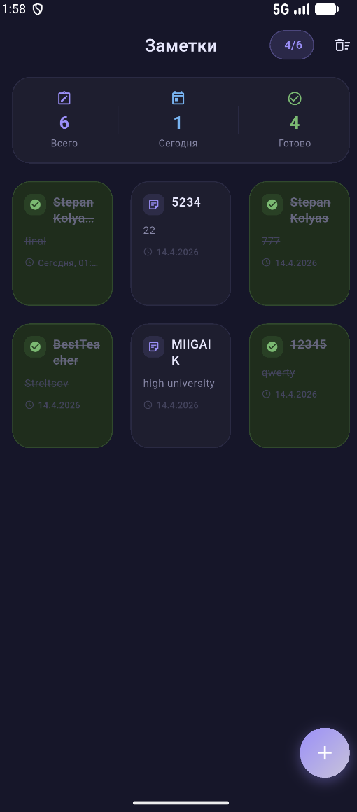
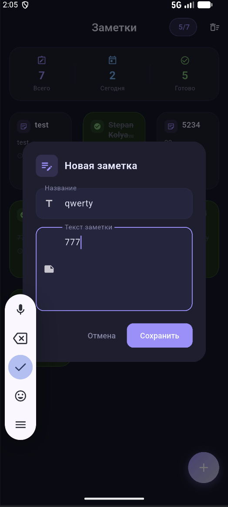
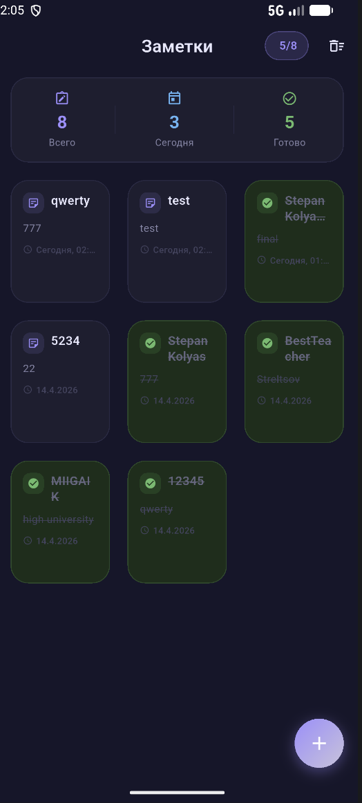
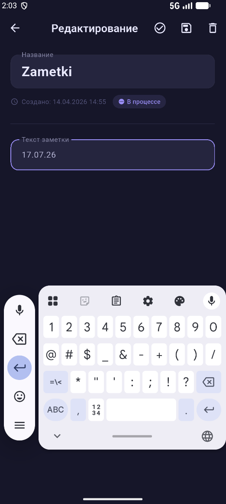
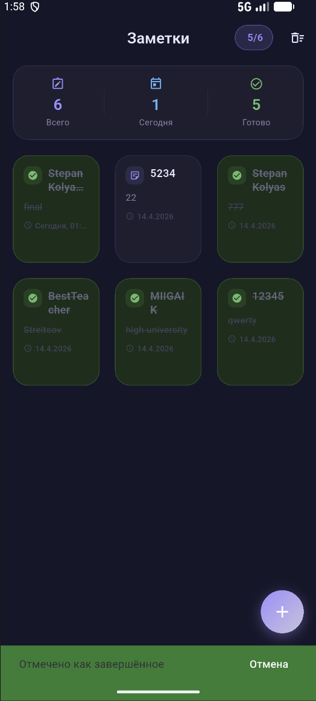
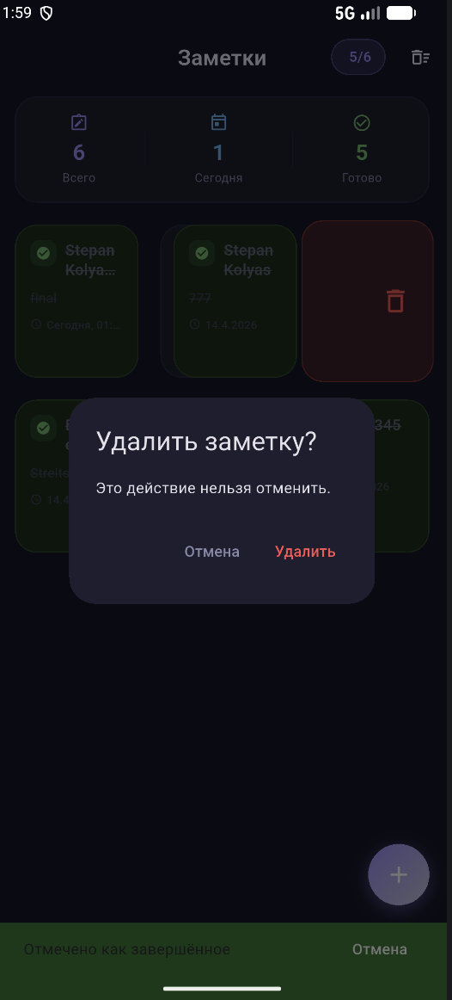
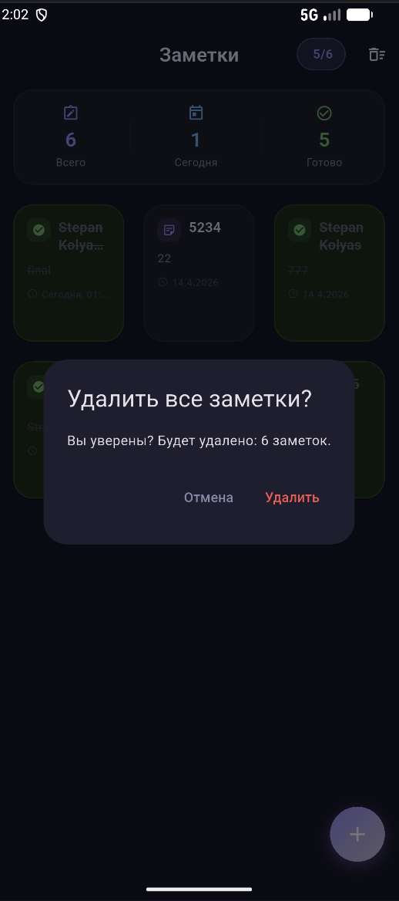

<div align="center">


# KolyasNotes

### Мобильное приложение «Заметки» на Flutter


</div>

---

## О проекте

**KolyasNotes** — мобильное приложение **«Заметки»**, разработанное на Flutter в рамках практической работы №2 по предмету **«Основы разработки мобильных приложений»**.

Цель работы — создать приложение с адаптивным интерфейсом, локальным хранением данных и полным набором CRUD-операций: создание, просмотр, редактирование и удаление заметок.

Приложение позволяет:

- создавать заметки с названием и текстом;
- просматривать список заметок в адаптивной сетке;
- открывать заметку на отдельном экране;
- редактировать название и содержимое;
- отмечать заметки как завершённые;
- удалять одну заметку свайпом или с экрана редактирования;
- удалять все заметки через отдельное подтверждение;
- сохранять данные локально на устройстве.

---

## Скриншоты

<div align="center">

### Главный экран



</div>

---

<div align="center">

### Основные сценарии работы

<table>
  <tr>
    <td align="center">
      <br>
      <b>Добавление заметки</b>
    </td>
    <td align="center">
      <br>
      <b>Заметка добавлена</b>
    </td>
    <td align="center">
      <br>
      <b>Редактирование</b>
    </td>
  </tr>
  <tr>
    <td align="center">
      <br>
      <b>Отметка выполненной</b>
    </td>
    <td align="center">
      <br>
      <b>Удаление одной заметки</b>
    </td>
    <td align="center">
      <br>
      <b>Удаление всех заметок</b>
    </td>
  </tr>
</table>

</div>

---

## Возможности

- **Адаптивная сетка заметок**: количество колонок меняется в зависимости от ширины экрана.
- **Статистика на главном экране**: всего заметок, создано сегодня, завершено.
- **Создание заметки** через диалоговое окно с полями «Название» и «Текст заметки».
- **Просмотр и редактирование** заметки на отдельном экране.
- **Локальное сохранение** данных через `shared_preferences`.
- **Сериализация в JSON** через `dart:convert`.
- **Статус выполнения**: завершённые заметки отображаются с зелёным фоном и зачёркнутым текстом.
- **Свайпы**:
  - свайп вправо — отметить заметку как завершённую или вернуть в работу;
  - свайп влево — удалить заметку после подтверждения.
- **Удаление всех заметок** через отдельный диалог подтверждения.
- **Тёмная Material 3 тема** в фиолетово-синем стиле.

---

## Архитектура проекта

Основной Flutter-проект находится в папке `app/`.

```text
app/
└── lib/
    ├── main.dart                       # точка входа, тема приложения, запуск NotesPage
    ├── models/
    │   └── note.dart                   # модель заметки: id, title, content, createdAt, isDone
    ├── screens/
    │   ├── notes_page.dart             # главный экран, сетка, статистика, CRUD-логика
    │   └── note_detail_page.dart       # просмотр, редактирование, удаление, смена статуса
    ├── services/
    │   └── storage_service.dart        # сохранение и загрузка заметок из SharedPreferences
    └── widgets/
        └── note_card.dart              # переиспользуемая карточка заметки
```
---

## Как устроено приложение

### Модель данных

Каждая заметка описана моделью `Note`:

```dart
class Note {
  final String id;
  final String title;
  final String content;
  final DateTime createdAt;
  final bool isDone;
}
```

Модель поддерживает:

- создание новой заметки;
- преобразование в JSON;
- восстановление из JSON;
- копирование с изменениями через `copyWith`;
- переключение статуса через `toggleDone()`.

---

### Хранение данных

Для локального хранения используется сервис `StorageService`.

Он сохраняет список заметок в `SharedPreferences` в виде JSON-строки и загружает его при запуске приложения.

```text
List<Note> → JSON → SharedPreferences → JSON → List<Note>
```

---

### Главный экран

На главном экране отображаются:

- заголовок приложения;
- счётчик завершённых заметок;
- блок статистики;
- адаптивная сетка карточек;
- кнопка `+` для добавления новой заметки;
- кнопка удаления всех заметок.

Количество колонок рассчитывается по ширине экрана:

```dart
if (width < 400) return 2;
if (width < 600) return 3;
if (width < 900) return 4;
return 5;
```

---

### Карточка заметки

Карточка показывает:

- иконку статуса;
- название;
- часть текста;
- дату создания;
- визуальное состояние выполнения.

Если заметка завершена, карточка становится зелёной, а текст зачёркивается.

---

## Используемые технологии

- **Flutter**
- **Dart**
- **Material 3**
- **shared_preferences**
- **dart:convert**
- **flutter_launcher_icons**
- Android SDK / Android Emulator

---

## Как запустить проект

### 1. Клонировать репозиторий

```bash
git clone https://github.com/kolyaspr/kolyas_notes_app.git
cd kolyas_notes_app/app
```

Если репозиторий будет создан под другим аккаунтом или названием, замените ссылку на свою.

---

### 2. Установить зависимости

```bash
flutter pub get
```

---

### 3. Проверить доступные устройства

```bash
flutter devices
```

---

### 4. Запустить на Android-эмуляторе

```bash
flutter run -d emulator-5554
```

Если идентификатор эмулятора другой, возьмите его из вывода команды `flutter devices`.

Обычный запуск на выбранном устройстве:

```bash
flutter run
```

---

## Как собрать APK

Так как Flutter-проект находится в папке `app/`, команды сборки нужно выполнять из неё:

```bash
cd app
flutter clean
flutter pub get
flutter build apk --release
```

Если вы уже находитесь внутри папки `app/`, команду `cd app` выполнять не нужно.

Готовый APK будет находиться по пути:

```text
app/build/app/outputs/flutter-apk/app-release.apk
```

Этот файл можно передать на Android-устройство и установить вручную.

---

## Как установить APK на Android

### Способ 1. Через файл APK

1. Соберите APK командами из раздела выше.
2. Найдите файл:

   ```text
   app/build/app/outputs/flutter-apk/app-release.apk
   ```

3. Передайте APK на Android-устройство.
4. Откройте файл на телефоне.
5. Разрешите установку из неизвестных источников, если Android попросит.
6. Установите приложение.

---

### Способ 2. Через ADB

Если устройство подключено по USB или запущен эмулятор, выполните команду из корня репозитория:

```bash
adb install app/build/app/outputs/flutter-apk/app-release.apk
```

При повторной установке:

```bash
adb install -r app/build/app/outputs/flutter-apk/app-release.apk
```

---

## Команды для разработки

```bash
cd app
flutter clean
flutter pub get
dart run flutter_launcher_icons
flutter run -d emulator-5554
flutter build apk --release
```

---

## Автор

**Колясинский Степан Александрович**  
Практическая работа №2  
Предмет: **Основы разработки мобильных приложений**  
МИИГАиК, 2026

---

<div align="center">

**KolyasNotes**  
Заметки, CRUD, адаптивная сетка и локальное хранение данных на Flutter

</div>
